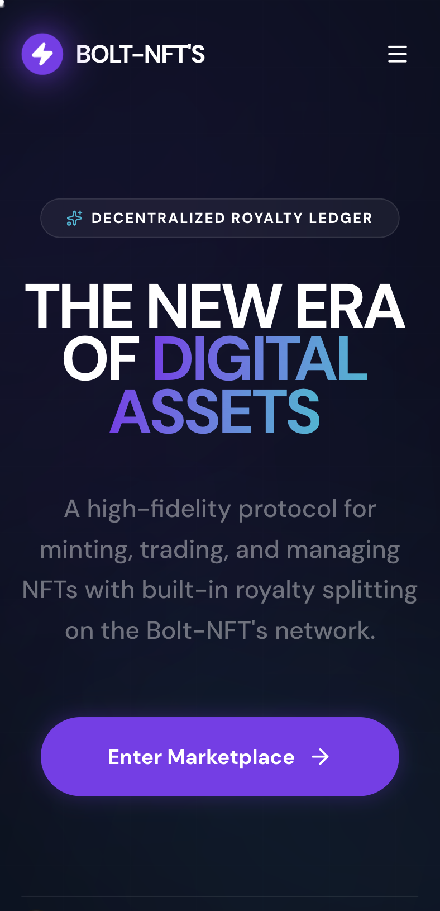
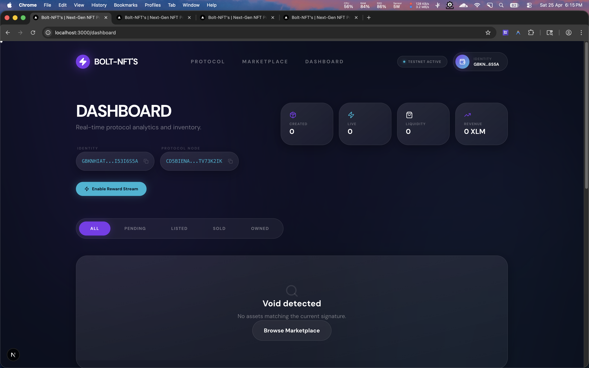
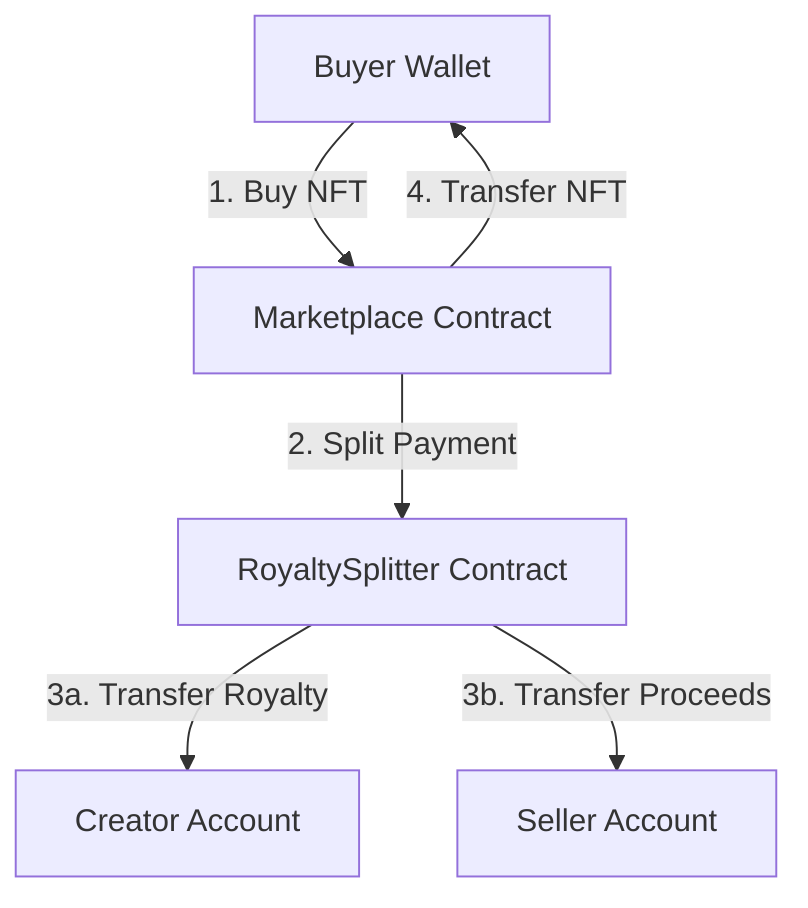

# Bolt-NFT's | Next-Gen NFT Protocol on Stellar (Level 4 Submission)

A production-ready NFT marketplace built on the Stellar network using Soroban smart contracts. This project demonstrates advanced contract patterns, including atomic inter-contract calls for automated royalty distribution and real-time sales tracking.

## 🚀 Live Demo
- **Live Application**: [https://nftmarket-iota.vercel.app/](https://nftmarket-iota.vercel.app/)
- **Deployment Status**: [Vercel Deployment](https://nftmarket-iota.vercel.app/)

## 📊 CI/CD Status


## 📱 Visual Preview

### Mobile Experience
<p align="center">
  
</p>

### Product Demo
<p align="center">
  
</p>

### Creator Dashboard (Desktop)


## 🛠️ Advanced Features (Level 4 Focus)
- **Inter-Contract Calls**: The Marketplace contract atomically invokes the `RoyaltySplitter` contract during a purchase to distribute funds between the seller and the creator in a single, trustless transaction.
- **Custom NFT Asset**: Implements the `STARTNFT` contract (ERC-721 equivalent on Soroban) for high-fidelity digital assets.
- **Real-Time Event Streaming**: Utilizes Stellar Horizon SSE to provide live updates on sales and listings without page refreshes.
- **Production-Ready CI/CD**: Fully automated pipeline for smart contract testing and frontend deployment.

## 🧱 Technical Architecture
The diagram below illustrates the atomic flow of an inter-contract royalty payment:



## ✅ Test Coverage & Verification

The core protocol is backed by a comprehensive suite of automated tests covering the entire NFT lifecycle and financial distribution logic.

### 🛡️ Smart Contract Security
| Scenario | Description | Status |
| :--- | :--- | :--- |
| **Atomic Royalty Splitting** | Verifies that payments are precisely divided between seller and creator in a single transaction. | `Passed` |
| **Inter-Contract Calls** | Ensures the Marketplace successfully invokes the Splitter contract for trustless distribution. | `Passed` |
| **NFT Asset Minting** | Validates ERC-721 equivalent minting logic and metadata integrity on Soroban. | `Passed` |
| **Authorization Guard** | Confirms `require_auth` prevents unauthorized listing/buying/delisting. | `Passed` |
| **Marketplace Lifecycle** | Tests listing, buying, and delisting edge cases (e.g., delisting after sale). | `Passed` |

### 🧪 Detailed Testing Guide
To verify the smart contract logic locally, follow these steps:

#### 1. Install Prerequisites
Ensure you have the [Stellar CLI](https://developers.stellar.org/docs/build/smart-contracts/getting-started/setup#install-the-stellar-cli) installed:
```bash
cargo install --locked stellar-cli --features opt
```

#### 2. Build the Contracts
The Marketplace contract requires the other contracts to be built first to import their interfaces:
```bash
# Build all contracts in the workspace
cargo build --target wasm32-unknown-unknown --release
```

#### 3. Run the Test Suite
Execute the integration tests which simulate a full marketplace environment:
```bash
cargo test
```

#### 4. Understanding the Tests
- **Integration Tests (`contracts/marketplace/src/test.rs`)**: These tests use a mocked environment to simulate multiple accounts (Seller, Buyer, Creator). It verifies that when a `buy_nft` call is made, the `RoyaltySplitter` contract is invoked atomically, funds are distributed, and ownership is transferred correctly.

## 📜 Deployed Contracts (Testnet)
| Contract | Address |
| :--- | :--- |
| **Marketplace** | `CCIGXUYLGJWZK3RZ7SMQD6RXGECU2X56AQTDUCXQH7S5PXKXCYEUWWWL` |
| **Royalty Splitter** | `CBGS3HWQ7JOH3MMLXY64ACEQHIY6XLD35EURXMTLILNCDURJBMAFV5ZA` |
| **STARTNFT Asset** | `CDP7NE5WFWA6U3Q6LFMZPQR2GVR5LTSELQGFBMBUDHVZPJRHUZSA7VCI` |

## 🔗 Transaction Hashes
- **Marketplace Deployment**: `fb501ed7cb89a6e3c0e2f0e6e2a81c062b57c27da7fd61aad6dd90535688e08f`
- **Splitter Deployment**: `c29c6f64990929076721e172d5e0d5e76630c2dcb0ec0697658df50c227122bf`
- **STARTNFT Deployment**: `196255819e6ab6e8d1e00ba64b56eaefcebfa9f576c4216479de92f978f5c9aa`

## 💻 Local Development

### Prerequisites
- Node.js 20+
- Stellar CLI (for contract testing)
- Freighter Wallet extension

### Setup
1. Clone the repository
2. Install dependencies:
   ```bash
   npm install
   ```
3. Configure environment:
   Create a `.env.local` with your `MONGODB_URI`.
4. Run development server:
   ```bash
   npm run dev
   ```

## ✅ Submission Checklist
- [x] Public GitHub repository
- [x] README with complete documentation
- [x] 8+ meaningful commits (Current: 14)
- [x] Live demo link
- [x] Product demo video
- [x] Mobile responsive screenshot
- [x] CI/CD status badge
- [x] Contract addresses & hashes
- [x] Test Coverage Documentation
- [x] Inter-contract calls implementation
- [x] CI/CD Pipeline (Passing)
- [x] Verified build stability
